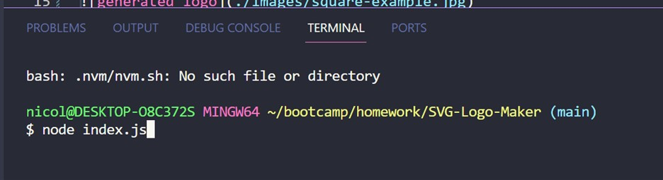
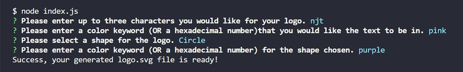
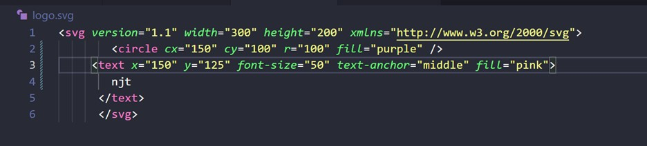

# SVG-Logo-Maker
A Node.js command-line application that takes in user input to generate a logo and save it as an SVG file

## Description
This application will assist you in gnerating a simple yet efficient svg logo by following prompted questions via Inquirer NPM

## Installation
#Node.js
#Inquirer 8.2.4
#Jest

## Usage
The client will open the commandline or terminal and begin by typing node index.js.
 Shortly there will be several questions that will populate one by one to help conifgure the desired design of the logo. You will know that the logo was successfull if you recieve a message stating "Success, Your generated logo.svg file is ready!" should it has encountered an error along the way it will then read "Unable to generate logo, please try again".

 Then you are able to open the new file logo.svg and view the generated logo.

## Questions 
Should you have any questions feel free to reach me with the contact information below
Name: 
Github: (https://github.com/NicoleT27)
Email: nicolejoan9@yahoo.com
Video:
